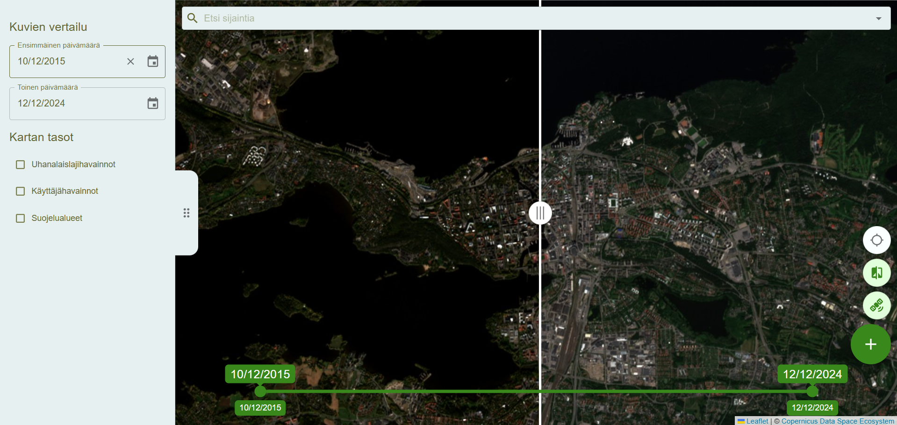

# 🌍 Pearl Satellite Comparison

<!-- Table of Contents -->

## Table of Contents

- [Overview](#Overview)
- [Features](#Features)
- [Installation](#Installation)
- [Usage](#Usage)
- [Environmental Variables](#Environmental-Variables)
- [Technologies used](#Technologies-used)
- [License](#License)
- [Acknowledgments](#Acknowledgments)
- [Contributing](#Contributing)
- [Contact](#Contact)

<!-- /Table of Contents -->

## Overview

Pearl Satellite Comparison is a project designed to compare satellite imagery for environmental monitoring and ecosystem
protection. This repository contains the tools, and resources necessary to visualize, and compare past satellite images to support
ecosystem preservation efforts.

Users can compare satellite imagery from different date to observe environmental changes over time.

Additionally the application includes three key layers for enhanced data visualization:

1. **Endangerment Species**: Displays Finnish sightings of endangered species.
2. **Conservation Areas**: Highlights protected areas, such as national parks and nature reserves.
3. **User Observations**: Enables users to report incidents or observations, which are then displayed on the map, providing real-time insights into local conservation efforts.

## Features

- **Map**: View map with a search option.
- **Satellite Layer**: See satellite imagery of the viewed area.
- **Comparison Tools**: Choose historical satellite images by dates and compare them side by side.
- **Reports**: Report about incidents and log them to the database.
- **API Integration**: Utilize third-party APIs for additional data sources (e.g., endangered species and conservation).

## Installation

### Prerequisites

- Install Node (v20.x or newer)
- Install Git
- Install any code editor
- Install Docker

### Steps

> `git clone https://github.com/Pearl-image-comparer/Pearl.git`

Navigate to the project directory:

> `cd pearl`

Install dependencies

> `npm install `

Create .env file to the project root and add all the required variables (see [wiki](https://github.com/Pearl-image-comparer/Pearl/wiki) for more information)

Start the project

> `npm run dev `

## Usage

1. Search for locations on the map.
2. View satellite imagery by selecting a specific date.
3. Compare images by adding a second date to display images side-by-side.
4. Toggle layers on and off to view additional information about the area.

## Environmental Variables

The `.env` file should include all of the below variables so make sure to add them before running the code

| Variable                 | Description                                                                      |
| ------------------------ | -------------------------------------------------------------------------------- |
| `COPERNICUS_INSTANCE_ID` | `<COPERNICUS-API-KEY>`                                                           |
| `LAJI_ACCESS_TOKEN`      | `<LAJITIETOKES-API-KEY>`                                                         |
| `POSTGRES_URI`           | `postgres://<USER>:<PASSWORD>@<ADDRESS>:5432/<DATABASE>`                         |
| `S3_REGION`              | `<S3-AREA>`                                                                      |
| `S3_ENDPOINT`            | `<S3-ADDRESS>`                                                                   |
| `S3_BUCKET`              | `<S3-BUCKET>`                                                                    |
| `S3_ACCESS_KEY_ID`       | `<ADDITIONAL-S3-KEY-ID>`                                                         |
| `S3_ACCESS_KEY`          | `<ADDITIONAL-S3-KEY-SECRET>`                                                     |
| `MEMCACHE_HOST`          | `<MEMCACHED-ADDRESS>`                                                            |
| `ADMIN_PASSWORD`         | `\$argon2id\$v=19\$m=65536,t=3,p=4\$<ADMIN-PASSWORD-SALT>\$<ADMIN-PASSWORD-KEY>` |
| `COOKIE_SECRET`          | `<RANDOM-PASSWORD-COOKIE-ENCRYPTION>`                                            |

## Technologies used

- **Frontend**:
  - Remix
  - Leaflet
  - Material UI
- **Backend**:
  - Remix
  - AWS S3 Bucket
- **Database**:
  - PostgreSQL
- **APIs**:
  - Laji.fi
  - Copernicus
  - SYKE

## License

This project is licensed under the [MIT License](/LICENSE)

## Acknowledgments

- Endangered species sightings: [laji.fi API](https://laji.fi/about/3120)
- Satellite imagery: [Copernicus API](https://dataspace.copernicus.eu/analyse/apis)
- Protected areas: [Finnihs enviromental institute](https://www.syke.fi/fi-fi/avoin_tieto/avoimet_rajapinnat)

## Contributing

While we may not be able to accept any pull requests to the main repository at this time, you're welcome to fork the repository and continue developing features or improvements in your own fork.

If you'd like to contribute to the project, here’s how you can get started:

1. Fork the repository – Create your own copy of the repository on GitHub.
2. Clone your fork – Use git clone to clone your forked repository to your local machine.
3. Create a branch – Create a new branch for your changes: `git checkout -b your-feature-branch`
4. Make changes – Implement your changes or new features.
5. Commit changes – Commit your changes with a clear, descriptive message: `git commit -m "<message>"`
6. Push to your fork – Push your changes to your forked repository: `git push origin your-feature-branch`
7. Develop further – Feel free to continue improving your fork, or even create your own version of the project with the changes you’ve made.

## Contact

Feel free to contact the team members for further information:

- **Frontend / Design**: [Noora Vainionpää](https://github.com/Noorae) - noora.t.vainionpaa@tuni.fi
- **Frontend / Design**: [Teemu Tontti](https://github.com/teemutontti) - teemu.tontti@tuni.fi
- **Backend / Technical Review**: [Jarkko Kuukkanen](https://github.com/kuukkanen) - jarkko.kuukkanen@tuni.fi
- **Backend**: [Joonas Riivari](https://github.com/JooRiiv) - joonas.riivari@tuni.fi
